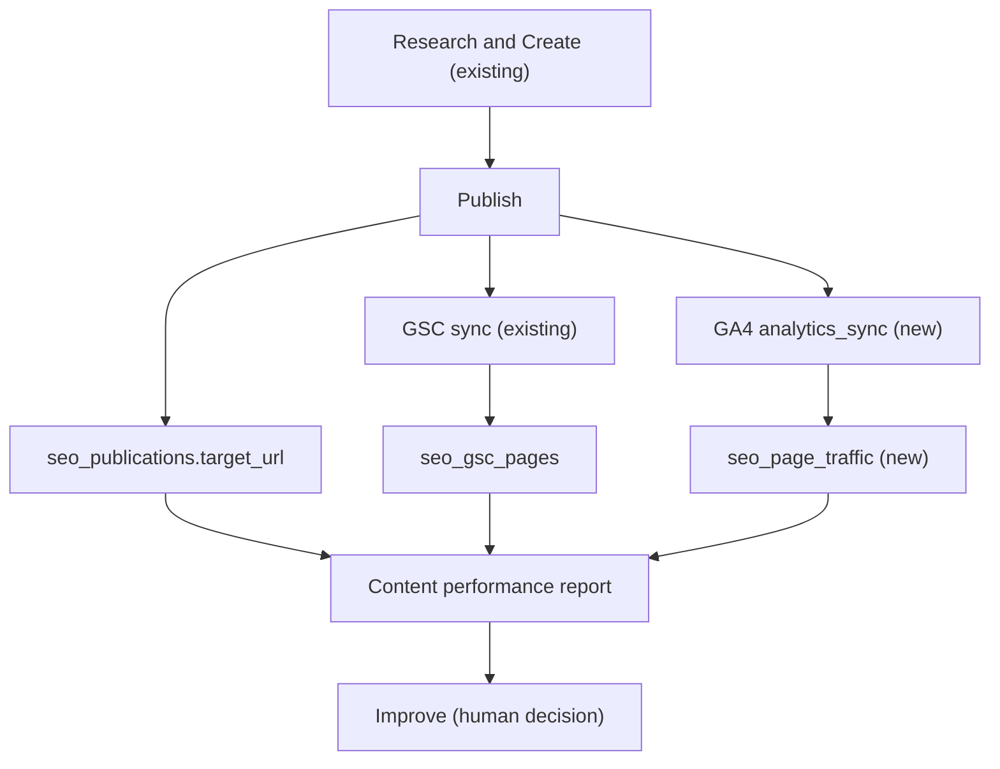

# P7 - Measurement loop

## Why

The P6 recon closed the product's creation and publishing surfaces but named one
architectural gap: the platform could research, create and publish, yet it could
not answer the question that closes the loop - *after we published this, what did
Google actually do with it?* Search Console performance was persisted and GA4
page traffic could be read live, but nothing tied a published content item to the
traffic and search results it produced.

P7 closes that loop with a durable, read-only join. It is deliberately **not**
automated SEO: no AI rewrites, no automatic optimisation, no second editor or
document model. It stores what Google reported and joins it onto what the
platform published.

## What was added

### 1. Persisted GA4 page traffic

Until P7, GA4 page traffic was read live per request and thrown away, so there
was no warehouse to join against. The new `analytics_sync` job reads daily
(`date` x `pagePath`) rows from the project's bound GA4 property and writes them
to `seo_page_traffic`, one row per `(project, property, date, path)`.

- Migration `20260101000038_content_measurement.sql` adds `seo_page_traffic`
  (metrics non-negative, numeric property id, unique natural key, RLS
  select-only for project members).
- `GoogleAnalyticsClient.runPageTrafficDailyReport` normalizes GA4's
  `YYYYMMDD` dates to ISO and drops unparsable rows rather than dating a guess.
- `GoogleAnalyticsService.dailyPageTraffic` reuses the account-scoped token
  lifecycle (refresh once on 401) and records real request usage under the job
  id, exactly like the live page-traffic path.
- `SeoWriter.persistPageTraffic` is the only writer; a re-sync overwrites the
  same natural key because GA4 is authoritative for a past date.

### 2. A GSC/GA4-aware job gate

GA4 is account-scoped like GSC but has no project data source (its binding is
`seo_project_analytics`). The shared enqueue gate (`apps/api/src/jobs/enqueue.ts`)
now resolves a connected account-scoped GA4 integration and exempts GA4 from the
project data-source requirement. GSC and GA4 therefore both go through the one
shared enqueue path; no route or executor talks to Google directly.

### 3. The measurement report

`ContentPerformanceService.report` reads only persisted rows (no live Google
call) and joins:

- the latest successful publication per content (`seo_publications.target_url`,
  written only after the publisher confirmed a remote id);
- published content (`seo_content`, including content marked published outside
  the platform);
- Search Console page rows (`seo_gsc_pages`);
- stored GA4 page traffic (`seo_page_traffic`).

Matching is host-agnostic and path-based: both GSC absolute URLs and GA4 paths
are reduced to one normalized path key and compared against the candidate paths
derived from a content item's published URL, `url` and `slug` using the existing
`contentPathKeys` vocabulary. The intelligence service and the report therefore
can never disagree about what "the same page" means.

Every row is labelled honestly:

- `measured` - at least one provider row matched;
- `no_traffic` - published but nothing matched for the period;
- no metric is fabricated, and a provider that is not configured is a human
  note ("Connect Search Console ..."), never a zero presented as evidence.

### 4. API and UI

- `GET /api/projects/:projectId/performance?days=7|28|90` (viewer+) returns the
  report.
- `POST /api/projects/:projectId/performance/sync` (editor+) enqueues a GSC
  and/or GA4 sync through the existing services, reusing an in-flight job when
  one exists, and reports what was skipped and why.
- The web view `Performance` (project nav "Performance") renders totals, the
  per-content table and the honest notes, with a Sync action for editors.

## Refresh cadence

GSC and GA4 data are not real-time, so P7 deliberately does not add an
aggressive background poller. Refresh is an explicit, repeatable user action
(`POST .../performance/sync`) that reuses the existing idempotent job services:

- a sync is only enqueued when the provider is actually configured for the
  project (GSC property linked, or GA4 property bound);
- an already queued/running sync is reused rather than duplicated;
- a re-sync upserts the same natural keys, so history never multiplies;
- a provider that fails leaves the last successful measurement intact and
  surfaces as an operational job failure.

This was chosen over a new scheduler because the P7 spec allows an explicit
on-demand refresh and forbids a worker/job-registry refactor. Daily background
scheduling can be added later through the existing job store without changing
this model.

## What P7 deliberately does not do

- No automated SEO changes: the loop ends at a human decision.
- No second editor, document state or save model - the unified workspace remains
  the source of truth.
- No new scheduler: the report reads persisted rows and the existing job store
  refreshes them.
- No fabricated metrics, no fabricated URL matching and no cross-project reads.

## Verification

- `DB_NAME=seo_p7_<epoch> bash scripts/db-migrate-local.sh` (fresh DB): applies
  migration 38 and passes the page-traffic upsert/check + RLS isolation smoke
  tests.
- `@seo/api`: typecheck, 2036 tests.
- `@seo/web`: typecheck, 824 tests.
- `pnpm lint` (0 errors), `pnpm build`, `git diff --check`.
