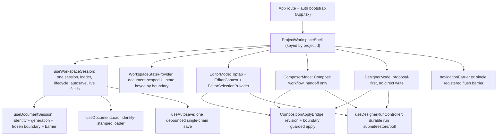

# R5.11 - Hardening Recon

Status: recon complete. **No code, schema, migration, vocabulary, route or test
change.** This document is the deliverable of R5.11: a code-level hardening
audit of the completed R5.1-R5.10 workspace.

Scope: find concrete integration defects, race conditions, stale-state hazards,
authorization gaps, inconsistent contracts, missing failure handling and
meaningful test gaps. Every finding below is grounded in a reachable code path
(`file:line`), a triggering sequence and an observable consequence. This is not
a technical-debt list; intentionally deferred R5.10 items are not re-opened.

Sources inspected (web): `App.tsx`, `lib/{navigationBarrier,nav,projectRoute,api,ui}.tsx`,
`workspace/{ProjectWorkspaceShell,workspaceSession,EditorMode,ComposerMode,DesignerMode,CompositionApplyBridge,useDesignerRunController}.tsx`,
`components/content/session/{useDocumentSession,useDocumentLoad,useOperationBoundary,documentSessionContext}.ts`,
`components/content/{useAutosave,documentRevision}.ts`,
`components/content/editor/{EditorContext,EditorSelectionContext}.tsx`,
`components/content/workspace/{workspaceState,useEmbeddedAgent,EditorWorkspace,EmbeddedAgentEntry}.tsx`,
`views/{Usage,Publishing,Compose,EditorView,Dashboard}.tsx`.
Sources inspected (api): `app.ts`, `http/{middleware,routes/*}.ts`,
`mcp/{http,session,server}.ts`, `services/{usageEventRepository,usageReportService,usageInstrumentation,aiService,embeddingService,publicationService,scheduleService}.ts`,
`jobs/{executors,types,supabaseJobStore,enqueue}.ts`, `worker.ts`,
`supabase/migrations/20260101000031_usage_events.sql`,
`supabase/migrations/20260101000005_jobs_publishing.sql`.
Prior recon inputs: `docs/r5.2.8-final-hardening-recon.md`,
`docs/r5.2.9-lifecycle-gaps.md`, `docs/r5.6.4-editor-integration-hardening.md`,
`docs/r5-post-5.5-architecture-recon.md`, `docs/r5.10-closeout-recon.md`.

---

## A. Current R5 architecture

### A.1 Process and state flow

### A.2 State / ownership map

| State | Canonical owner | Notes |
| --- | --- | --- |
| Route + auth/account/project membership | `App.tsx` (`parseRoute`, `/me` bootstrap, `TOP_NAV`/`PROJECT_NAV`) | project id from route is authoritative |
| Document identity (`{documentId, creating}`) | `useDocumentSession` | single identity owner |
| Session generation + frozen document `boundary` | `useDocumentSession` | both advance only on a barrier `switched`; preserved by id adoption |
| Document lifecycle (idle/loading/ready/error) | `documentLifecycle` over `useDocumentLoad` | pure projection; no second readiness flag |
| Loaded document payload | `useDocumentLoad` (id-stamped, per-run `alive`) | late/mismatched responses dropped |
| Editor revision (concurrency token) | `documentRevisionOf` -> `contentRevisionOf` | server derives the same token |
| Workspace revision (doc + metadata) / snapshot | `workspaceRevisionOf` / `workspaceSnapshotOf` | autosave dirty + debounce key |
| Autosave (status, dirty, one in-flight chain, `flush`) | `useAutosave` | single mechanism |
| Save barrier for document-leaving transitions | `useDocumentSession.runBarrier` over `useAutosave.flush` | refuses on `save_failed` / `save_in_progress` |
| Live editable fields mirror | `workspaceSession.live` ref | synchronous mirror for autosave; not authoritative |
| Selection | `EditorSelectionContext` | single boundary; cleared on `documentId` change |
| Editor instance / history boundary | `EditorMode` + `RichTextEditor key = editorHistoryKey` | remount only on logical doc change |
| Document-scoped workspace UI state | `WorkspaceStateProvider` / `useDocumentScopedState` | preview, rail, tools, preview viewport, assistant-open |
| Editor AI state (configured, busy) | `EditorMode` local | editor-mode only |
| Durable run lifecycle (submit/restore/poll/stop) | `useDesignerRunController` | one controller for editor + designer surfaces |
| Staged mutation handoff | `ProjectWorkspaceShell.pendingComposition` (state) + `CompositionApplyBridge` (apply) | boundary + `targetDocumentId` + `baseRevision` guarded |
| Navigation barrier | `lib/navigationBarrier.ts` (single slot) | registered by workspace while mounted |
| Usage facts (append-only) | `seo_usage_events` via `UsageEventStore` | idempotency in DB, best-effort append |
| Usage read/report | `usageReportService` over `seo_usage_totals` | project/account re-authorized in RPC |
| Publishing records + jobs | `seo_publications` + `seo_sync_jobs` | job row is the durable unit |
| MCP identity + scope | `depsFromApiKey` (`project`/`account` key) | per-call `resolveProjectId` |

No second identity, generation, revision, autosave, selection or lifecycle owner
was found. The `pendingComposition` state and the shared `useAsync` data cache
are the two places where state sits near, rather than strictly on, the boundary
(see H5, H9).

---

## B. Hardening matrix

Severity: Critical = cross-project/security/data-loss; High = wrong-document
mutation, lost edits, broken publish, serious state corruption; Medium =
contained correctness/reliability; Low = defensive/cleanup with limited impact.

| # | Area | Seam / file | Invariant | Failure scenario | Severity | Existing test | Recommended fix |
| - | ---- | ----------- | --------- | ---------------- | -------- | ------------- | --------------- |
| H1 | Session / navigation | `App.tsx:112-116` (popstate), `App.tsx:176-193` (navigate), `workspaceSession.tsx:210-216` (unmount) | Every document-leaving transition crosses the save barrier | Dirty document; user presses browser Back/Forward (or a deep link replaces the route). `popstate` calls `setRoute(parseRoute())` directly - no `runNavigationBarrier`. The workspace unmounts and its cleanup fire-and-forgets `flush()`, which cannot refuse and whose failure is swallowed. Edits in the debounce window / a failed save are abandoned with no error. | High | `navigationBarrier.test.ts` (programmatic only), `nav.test.ts`; no popstate/unmount test | Route popstate through the barrier (await, and restore the prior URL when refused) or add a dirty-only `beforeunload`/`pagehide` guard that never claims a completed save |
| H2 | Session / exit | `apps/web/src` (no `beforeunload`/`pagehide`/`visibilitychange`/`sendBeacon`) | Unsaved edits survive reload/close or the user is warned | Dirty document; user reloads, closes the tab or the OS kills the tab. Nothing warns; the in-flight debounce is lost. | High | none | Dirty-only `beforeunload` prompt; optional `sendBeacon`/local flush. Honest copy: never claim "saved" |
| H3 | Publishing | `publications.ts:164-197`, `Publishing.tsx:216-229`, `executors.ts:787-821`, schema `20260101000005_jobs_publishing.sql:101-131` | A publication is published at most once; retries do not duplicate the remote effect | (a) Click "Publish" on an already `published` row - the row button is not status-gated and the action route always enqueues a new job. (b) A job retry after `adapter.publish` succeeded but the row update failed re-runs `adapter.publish` (`executors.ts:814-819` has no `remote_id`/status short-circuit). Result: duplicate posts on WordPress/X. | High | `executors.publish.test.ts` (happy paths), `providerUsage.test.ts`; no re-publish/retry-duplicate test | Short-circuit `operation==='publish'` when the row already has a confirmed `remote_id`; gate the UI action by status; enqueue with `idempotency_key` (the job table already has `seo_sync_jobs_idempotency_unique`) |
| H4 | Views / loaders | `lib/ui.tsx:32-63` (`useAsync` keeps `data` across deps change), `views/Dashboard.tsx:62` (`loading && !data`) | A project-scoped view never renders another project's data | Switch project via the header select (`App.tsx:465-483`) while on Dashboard: the same `Dashboard` instance receives the new `projectId`; `useAsync` sets `loading` but retains the old `data`, so `loading && !data` is false and Project A's metrics render under Project B until the new response resolves. | Medium | `Usage.test.tsx` (guards `loading` first, safe) | Either reset `data` on deps change in `useAsync`, or have consumers gate on `loading` (not `loading && !data`); key project views by `projectId` |
| H5 | Workspace state | `ProjectWorkspaceShell.tsx:166` (`pendingComposition` state), `:288-348` (`applyComposition`/`appendComposition`), `:363-391` (`applyDesignerProposal`), `CompositionApplyBridge.tsx:157-187` | Staged mutation is scoped to the document it was built for | A composition/designer mutation is staged, then the open document changes before the bridge applies. The shell does not clear `pendingComposition` on a boundary change; the bridge is what rejects it (`session.boundary !== pending.boundary` -> `stale-document`). While it lingers, a returning editor mounts the bridge only to reject; there is no wrong-document write, but the shell banner state is owned outside the boundary. | Low | `CompositionApplyBridge.test.tsx` (17), `ComposerMode.handoff.test.tsx` (4) | Reset `pendingComposition` when `session.boundary` changes (e.g. scope it by the boundary), so a stale handoff is discarded at the owner rather than at apply time |
| H6 | Workspace state | `workspaceState.tsx:33-48` | A setter can only mutate the scope it belongs to | A setter captured under boundary A and invoked after the boundary moved to B writes `{scope: A, value}`, replacing the entry and discarding B's stored value; reads then fall back to `initial`. Not reachable with today's synchronous event setters, but the hook's own contract is not enforced. | Low | `workspaceState` tests (scoping) | Guard the setter: ignore a write whose captured `scope` no longer matches the live scope |
| H7 | Publishing / isolation | `executors.ts:791`, `:808-809`, `:816-819` (`.update(...).eq('id', ...)` only) | Project-scoped writes are filtered by `project_id` | The executor validates ownership on read, then updates the publication by id alone. A future code path with an unvalidated id, or a row moved between projects, would write across the boundary. No IDOR is reachable today (the read is project-scoped). | Low | `executors.publish.test.ts` | Add `.eq('project_id', job.project_id)` to the publication updates (defense in depth) |
| H8 | Publishing | `publications.ts:187` | Destructive actions map to a distinct, correct status | `.update({ status: body.action === 'delete' ? 'queued' : 'queued', error: null })` - both branches are `'queued'`. The ternary is a no-op; the intent (a `delete` action should not present as a normal queued publish) is lost. | Low | none | Remove the no-op ternary or map `delete` to its intended status |
| H9 | Composer handoff | `views/Compose.tsx:224-238` | A created draft is either opened or reported | `beginHandoff` -> POST `/content` succeeds -> `handoff.isStale()` returns true (document/mode moved) -> the function returns without opening the created row; the draft is persisted but the user is not taken to it (and no notice is set). | Low | `ComposerMode.handoff.test.tsx` (4) | On a stale handoff, refresh the content list and set a notice that the draft was created but not opened (do not delete server-side) |
| H10 | Selection | `EditorSelectionContext.tsx:56-79` (clear keyed on `documentId`) | Selection cannot leak across a document boundary | On a first-save id adoption the editor does not remount but `documentId` changes `null -> id`, clearing the canonical selection once. Transient and self-healing. Known G7. | Low | selection tests | Key the clear on the session `boundary` instead of `documentId` (deferred; record only) |

### H1 detail (highest-value finding)

R5.9 introduced `lib/navigationBarrier.ts` and routed `navigate`
(`App.tsx:176-193`) and `openProjectView` (`lib/nav.ts:17-33`) through it. Those
are the only guarded paths. The route also changes through:

- `popstate` (browser Back/Forward): `App.tsx:112-116` sets the route directly.
- Direct URL entry / reload: the initial `parseRoute()` (`App.tsx:106`).
- `signOut` (`App.tsx:402-405`) uses `window.location.href`.

For in-app Back/Forward this is user-visible: from a dirty document, pressing
Back to a sibling project view unmounts `ProjectWorkspaceShell`. The unload
effect (`workspaceSession.tsx:210-216`) calls `void flushRef.current()` with no
await and no refusal path, and `runBarrier` is never consulted, so:

1. the route changes immediately (the editor is gone before the flush settles);
2. a failed flush produces no banner and no retry;
3. edits within the 1600 ms debounce (`workspaceSession.tsx:193`) may not be
   sent at all if the flush loses the race with process/tab teardown.

This is the remainder of the R5.2 G3 gap that R5.9 explicitly left for R5.11
(`docs/r5.2.8-final-hardening-recon.md:183-188`, `docs/r5.6.4...:95`).

### H3 detail (publishing idempotency)

`seo_sync_jobs` already enforces `unique (idempotency_key)`
(`20260101000005_jobs_publishing.sql:37`) and `JobStore.enqueue` accepts
`idempotency_key` (`jobs/types.ts:42`, `supabaseJobStore.ts:80`). Neither the
create route (`publications.ts:150-157`) nor the action route
(`publications.ts:189-195`) passes one, and the executor does not short-circuit a
repeat publish, so the at-least-once worker can duplicate a remote post. The
usage model intentionally counts a retried physical attempt as new
(`usageInstrumentation.ts:45-58`), which is correct and separate from making the
remote effect idempotent.

---

## C. Confirmed-safe areas (no defect found)

These subsystems were inspected against their stated invariants and held up; no
fix is proposed merely because they were read.

1. **Switch barrier and save failure** - `useDocumentSession.runBarrier`
   (`useDocumentSession.ts:151-171`) refuses on `save_failed` and
   `save_in_progress`; a thrown flush is treated as unsaved and keeps the current
   document authoritative. `switchingRef` serializes concurrent switches.
2. **Generation / history boundary** - `generation` and `boundary` advance only
   inside `runBarrier` after `flush` resolves true (`:157-164`);
   `adoptDocumentId` (`:192`) and `discardDocument` deliberately do not create a
   new logical boundary. `editorHistoryKey` delegates to `documentScopeKey`, so
   the editor key and the workspace-state key share one epoch.
3. **Identity-keyed loading** - `useDocumentLoad` stamps state with the
   requested id, clears payload on change, drops late responses with a per-run
   `alive` guard, and `documentLifecycle` treats a mismatched loader as
   `loading` (`useDocumentSession.ts:64-78`), so a stale id cannot reach
   `ready`.
4. **Autosave single chain** - `useAutosave` (`useAutosave.ts:64-102`) has one
   in-flight chain; a save that completes with newer edits loops instead of
   overlapping. `dirty` is derived from the same revision `runSave` compares
   (`:146`), so dirty and save cannot disagree. A failed persist sets `failed`
   and returns false without advancing the baseline (`:83-87`), so a failed save
   cannot mark the workspace clean or switch documents.
5. **Revision contract** - `documentRevisionOf` (concurrency token, server
   derives the same) and `workspaceRevisionOf` (doc + metadata) both derive from
   `contentRevisionOf` (`documentRevision.ts:24-73`); no competing revision
   system found.
6. **Composition / Designer apply guards** - `CompositionApplyBridge`
   (`:157-187`) checks the frozen `boundary`, the `targetDocumentId` and the
   proposal `baseRevision` before applying; `applyDesignerProposal`
   (`ProjectWorkspaceShell.tsx:363-391`) additionally pins the open
   `documentId`. A staged change for another document is rejected, never
   rebased.
7. **Project isolation on the API** - every project-scoped route under
   `apps/api/src/http/routes` calls
   `container.access.requireRole(user.sub, projectId, role)` before touching a
   service (verified across `content`, `designer`, `composition`, `cosmos`,
   `knowledge`, `opportunities`, `media`, `publications`, `schedules`,
   `usage`); `parseProjectId` reads the path parameter, never the body. Services
   filter by `project_id` on read and write.
8. **Usage read authorization** - `GET /api/projects/:id/usage` requires viewer
   (`usage.ts:65-79`) and `GET /api/account/usage` requires
   `requireAccount` (`:85-97`); the aggregate RPC re-checks membership / account
   ownership (`20260101000031_usage_events.sql:181-186`) and never filters by
   `user_id`, so project totals include all members' and jobs' facts.
9. **Usage append is best-effort** - `appendUsage` logs and swallows
   (`usageInstrumentation.ts:97-107`); `executors.publish.test.ts:310` pins that
   a ledger failure cannot fail a successful publication.
10. **MCP authorization** - a project key is bound to one project and an
    explicit `project_id` must match (`mcp/server.ts:121-141`); an account key
    requires the owner to be a viewer/editor member per call (`:140`); read/write
    tools are filtered by key scope (`:100-106`, `:771-772`). No MCP tool reads
    Postgres or a provider directly; all call core services.
11. **No credential leak to the client** - the web bundle only uses the Supabase
    anon key and sends its session token (`lib/api.ts`); provider credentials
    stay server-side (encrypted in `seo_credentials`).
12. **Usage view consistency** - `Usage.tsx` gates on `loading` before `data`
    (`:35-40`), so a project switch never renders the previous project's totals.

---

## D. Deferred / intentional behavior (not defects)

1. **Browser-exit protection (G3)** - no `beforeunload` was ever accepted as
   in-scope; explicitly deferred from R5.2 to R5.11
   (`r5.2.8...:183-188`). H1/H2 are that deferral coming due, not a regression.
2. **`popstate` back/forward routing** - recorded as a known routing limitation
   in `r5-post-5.5-architecture-recon.md:327` and `r5.6.4...:95`. H1 upgrades it
   from "limitation" to a concrete save-barrier bypass.
3. **G7 selection clear on id adoption** - `EditorSelectionProvider` clears on
   `documentId`; transient and self-healing (`r5.6.4...:90-92`). H10.
4. **Rail tab reset on Tools close/reopen** - expected for an on-demand surface
   (`r5.6.4...:93`).
5. **Unmetered external calls** - Cohere rerank, Jina fetch, CDN asset
   acquisition, retention/partitioning, account-scoped GSC discovery,
   BYOK-at-provider-seam (`r5.10-closeout-recon.md` section D). Out of R5.11 by
   the brief.
6. **`EmbeddingService`/`ProjectEmbedder` dead seam** - deprecated in R5.10.8,
   no production caller (`embeddingService.ts:21,49`); `imageGenerationUsageEvent`
   no longer called. Retained compatibility, not reachable.
7. **`DesignPackage`** - zero runtime consumers; retained as a portable contract
   (`r5-post-5.5...:275-294`).
8. **Legacy route redirects** (`content`/`compose`/`designer` ->
   `workspace`) - reachable compatibility shims (`App.tsx:158-168`,
   `:344-346`); the redirect uses `replaceState` without the barrier, but the
   source route cannot hold an open workspace, so it is benign.

---

## E. Proposed hardening slices

Smallest sensible implementation boundaries, ordered by dependency. Each is
independently verifiable (typecheck/build/test green, no PR, `docs(r5)` report).

1. **H1+H2 - Session exit/navigation hardening** (highest priority, one slice):
   route `popstate`/initial navigation and unmount through the existing save
   barrier, and add a dirty-only `beforeunload`/`pagehide` guard. Reuses
   `runNavigationBarrier` and `useAutosave.flush`; introduces no second
   unsaved-change mechanism. Acceptance: dirty document + Back/Forward either
   saves-then-navigates or stays with a banner; reload warns while dirty and
   never claims "saved".
2. **H3 - Publishing idempotency**: gate the publish action by status, pass a
   deterministic `idempotency_key` when enqueuing publish jobs, and short-circuit
   the executor when the row already has a confirmed remote id. Acceptance: a
   second publish of a published row (and a simulated retry after adapter
   success) does not call the adapter twice.
3. **H4 - Project-scoped view freshness**: reset `useAsync` data on deps change
   (or gate consumers on `loading`), so a project switch never shows the prior
   project's data. Small, shared-hook change plus a test.
4. **H5+H6 - Workspace-state boundary correctness**: reset `pendingComposition`
   on boundary change and enforce the `useDocumentScopedState` setter's scope
   contract. Defensive; low risk.
5. **H7+H8+H9 - Publishing/Composer defensive cleanup**: add `project_id` to the
   executor updates, fix the `delete` status mapping, and report a stale Composer
   handoff. Bundle because all three are small and in the same surfaces.
6. **H10 - Selection boundary (optional)**: key the selection clear on the
   session `boundary`. Only if H5/H6 touch the same area.

No slice touches schema, migrations, vocabulary, contracts or provider
adapters. No slice redesigns the session/revision/selection model.

---

## F. Test coverage audit

Real invariants covered: session barrier and lifecycle (`session/*.test.ts`),
workspace-state scoping, editor integration (`ProjectWorkspaceShell.*`),
composition apply (`CompositionApplyBridge.test.tsx`), Composer handoff,
Designer run controller, project scope, usage reporting (`Usage.test.tsx`),
usage producers/repository (`usageInstrumentation`, `usageEventRepository`,
`executors.publish`, `providerUsage`), MCP (`mcp/server.test.ts`).

Gaps tied to the findings above:

- No test drives route change via `popstate`/unmount with a dirty document, so
  H1 is untested by construction (only programmatic `navigate`/`openProjectView`
  are covered).
- No `beforeunload`/exit test (H2).
- No re-publish or retry-after-partial-success test for publishing (H3); the
  existing suite covers only clean paths and safe failures.
- No test that a project-scoped view clears/ignores the previous project's data
  on a project switch (H4); `Usage.test.tsx` is safe only because it renders
  `loading` first.
- No test for a staged handoff that outlives a boundary change at the shell
  owner (H5); the bridge-level rejection is covered.

These are integration-seam gaps, not missing line coverage: each existing
component test passes while the defect lives between the component and the
router/unmount lifecycle. Per the brief, no tests are added during recon.

---

## G. Build / runtime verification (R5.11 state)

Run at recon time on a clean tree (`HEAD c3d3465`):

| Check | Result |
| --- | --- |
| `pnpm --filter @seo/contracts build` | PASS |
| `pnpm --filter @seo/api typecheck` | PASS |
| `pnpm --filter @seo/api build` | PASS |
| `pnpm --filter @seo/api test` | 142 files, 1812 tests PASS |
| `pnpm --filter @seo/web typecheck` | PASS |
| `pnpm --filter @seo/web test` | 74 files, 705 tests PASS |
| `git diff --check` | clean |

Targeted integration suites relevant to R5:
`ProjectWorkspaceShell.context.test.tsx`, `ProjectWorkspaceShell.projectScope.test.tsx`,
`CompositionApplyBridge.test.tsx`, `ComposerMode.handoff.test.tsx`,
`useDesignerRunController.test.tsx`, `nav.test.ts`, `navigationBarrier.test.ts`,
`usageInstrumentation`/`usageEventRepository`/`executors.publish` tests,
`mcp/server.test.ts`.

---

## H. Closeout assessment

**CONCRETE HARDENING SLICES REMAIN.**

The R5.1-R5.10 architecture is structurally sound: the session, revision,
autosave, selection, history, workspace-state and usage owners are unambiguous,
and the API/MCP authorization surface is consistently enforced server-side. The
remaining work is concentrated in two real problem classes plus contained
cleanup:

- **Real data-loss risk (High):** H1 and H2 - browser Back/Forward and
  reload/close bypass or cannot block the save barrier. This is the deferred R5.2
  G3 coming due; it is exactly what R5.11 exists to close.
- **Real correctness risk (High):** H3 - publishing is not idempotent, so a
  repeat action or a worker retry can duplicate a remote post, despite the job
  table already supporting idempotency keys.
- **Contained correctness (Medium):** H4 - project-scoped views can briefly
  render the previous project's data on a project switch.
- **Defensive (Low):** H5-H10.

Recommended first slice: **H1+H2 session exit/navigation hardening**, followed by
**H3 publishing idempotency** and **H4 view freshness**. H5-H10 can follow as
one defensive cleanup slice. No architectural follow-up recon is required; each
finding has a concrete, in-place remediation.
