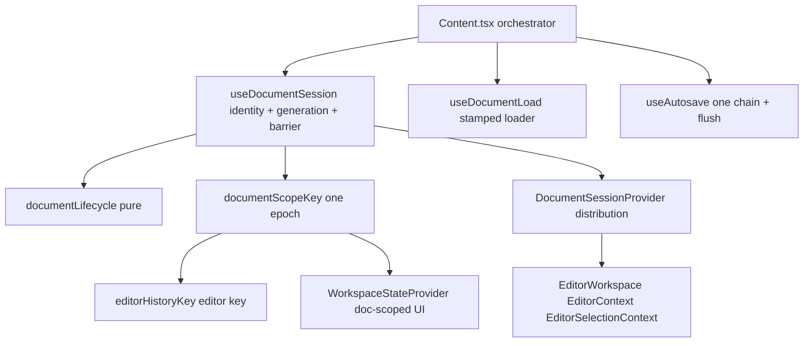

# R5.2.8 - Final session boundary hardening recon

Status: recon complete. No production behavior changed. One new expected-to-pass
gap marker test was added (`useDocumentSession.test.ts`, marked `it.fails`).

> Update (R5.2.9): the two material gaps found here - G1 (id adoption moved the
> document boundary and refetched) and G2 (legacy inline AI was not
> identity-guarded) - were closed in `docs/r5.2.9-lifecycle-gaps.md`. The `it.fails`
> marker below was converted into a passing assertion. G3 (browser exit / route
> unmount protection) remains deferred to R5.11 or the R5.3 navigation shell.

This slice answers, after R5.2.7, whether any material document/session lifecycle
leaks remain before R5.2 is closed and R5.3 begins.

## 1. Current architecture summary

R5.2 funnels the whole editor surface through one session boundary. The pieces:

- `useDocumentSession` (`apps/web/src/components/content/session/useDocumentSession.ts`)
  owns the authoritative `DocumentIdentity` (`{ documentId, creating }`) and the
  session `generation`. Every document-leaving action (`requestDocumentSwitch`,
  `requestNewDocument`, `requestCloseDocument`) crosses the save barrier
  (`runBarrier`, lines 140-157) and only then advances identity + generation.
  `adoptDocumentId` and `discardDocument` change identity without a barrier.
- `useAutosave` (`apps/web/src/components/content/useAutosave.ts`) is the single
  debounced autosave with a single in-flight chain and an awaitable `flush()`.
- `useDocumentLoad` (`session/useDocumentLoad.ts`) is the identity-keyed loader;
  a late response is dropped by a per-run `alive` guard and the state is stamped
  with the id it describes.
- `documentLifecycle` (in `useDocumentSession.ts`, lines 64-78) is the single
  pure loading/ready/error projection of identity + loader.
- `documentScopeKey(identity, generation)` (lines 99-102) is the single document
  boundary key. `editorHistoryKey` delegates to it (lines 115-117), so editor
  history and document-scoped workspace UI state share one epoch.
- `WorkspaceStateProvider` / `useDocumentScopedState`
  (`workspace/workspaceState.tsx`) is the single owner of document-scoped UI
  state, keyed by `documentScopeKey` without reset effects or remounts.
- `DocumentSessionProvider` (`session/documentSessionContext.tsx`) distributes
  the authority to consumers; it creates nothing.
- `EditorContext` owns the live editor document/revision/apply guards;
  `EditorSelectionContext` is the single selection owner.
- `Content.tsx` is the orchestrator: it calls `useDocumentSession`,
  `useDocumentLoad`, `useAutosave`, computes the lifecycle, seeds the workspace
  on load, and wraps `EditorWorkspace` in `WorkspaceStateProvider`.

## 2. Ownership matrix

| Concern | Single owner | Consumers | Verdict |
| --- | --- | --- | --- |
| Document identity | `useDocumentSession` (`DocumentIdentity`) | `DocumentSessionProvider`, `Content.tsx` | one owner |
| Document lifecycle | `documentLifecycle` (pure) over `useDocumentLoad` | `Content.tsx`, `EditorWorkspace` | one owner |
| Revision / dirty | `documentRevision.ts` + `useAutosave.dirty` | `Content.tsx`, `EditorContext`, agent | one model |
| Save barrier | `useDocumentSession.runBarrier` over `useAutosave.flush` | `Content.tsx` switch paths | one barrier |
| Autosave | one `useAutosave` in `Content.tsx:245` | session barrier, Save button | one mechanism |
| Selection | `EditorSelectionContext` | toolbar, `EditorContext`, composition | one owner |
| Editor history boundary | `editorHistoryKey` -> `documentScopeKey` | `RichTextEditor key` | one epoch |
| Document-scoped UI state | `WorkspaceStateProvider` / `useDocumentScopedState` | `EditorWorkspace`, `IntelligenceRail`, `EditorShell` | one owner |
| Doc content token | `documentRevisionOf` / `contentRevisionOf` | `EditorContext` apply guards | one token |
| Editor operation epoch | `useEmbeddedAgent` `identityRef` + `epochRef` | embedded Agent only | operation-scoped, allowed |

No second identity, generation, revision, autosave or selection system was found.
The `live` ref in `Content.tsx:178-179` is an intentional synchronous mirror of
the editable fields for autosave, refreshed every render; it is not authoritative
and does not diverge (autosave reads `live.current` and the revision from the same
object). `WriterPanel` localStorage stores an in-flight run id per
project/content, not document content.

## 3. Browser-exit findings (question 1)

There is no unload/exit protection anywhere in `apps/web/src` (no `beforeunload`,
`pagehide` or `visibilitychange`; verified by search). Consequences:

- Reload / tab close: any edit inside the 1600 ms autosave debounce
  (`Content.tsx:247`) is lost; a previously failed save leaves the document dirty
  with no exit warning.
- In-app navigation away from Content: the sidebar, project switcher and
  browser back/forward all re-route through `App.tsx` (`popstate` at lines
  140-144, `goProject` at 186-190) and simply unmount `Content` (route switch at
  `App.tsx:325`). None of these paths call the session barrier; only the in-app
  "Back to list" (`goList`) and list-item `open` do. So navigating to another
  project view while dirty bypasses the barrier entirely.
- Browser back/forward within the app is only a route change; it is not guarded.

Honest limits: `beforeunload` can only show a best-effort browser prompt. It
cannot guarantee that an async autosave completes during unload, so a warning
must not claim the document is saved; a `sendBeacon`/localStorage fallback would
be a separate, testable design. It must be installed only while dirty and must
not interfere with the internal barrier (which already blocks switching).

Classification: **gap**, but **deferred**, and it does not block R5.3. The
recon recommendation is to defer browser-exit protection to R5.11 (end-to-end
hardening) or a dedicated R5.2.10, and to handle in-app route unmount inside the
R5.3 shell where navigation becomes a first-class, guardable action. Installing a
permanent `beforeunload` now would be premature: R5.3-R5.6 will change the
navigation topology.

## 4. Async race findings (question 2)

| Race | Protected? | Evidence |
| --- | --- | --- |
| Late document-load response | yes | `useDocumentLoad.ts:41-56` `alive` guard + stamped id; `documentLifecycle` treats a mismatched loader as `loading` (`useDocumentSession.ts:70-72`) |
| Stale editor instance | yes | `editorHistoryKey` key on `RichTextEditor` (`EditorWorkspace.tsx:144-146`) |
| Stale workspace-state transition | yes | keyed scope, stale setter cannot be read back (`workspaceState.tsx:33-47`; R5.2.7 tests 1-7) |
| Switch immediately followed by switch | yes | `runBarrier` refuses with `save_in_progress` (`useDocumentSession.ts:141`) |
| New document then open existing | yes | barrier serializes; generation advances per successful transition (R5.2.5 tests) |
| Failed switch then retry | yes | identity/generation unchanged on block; reload path preserved |
| Close then reopen | yes | generation advances; fresh boundary (R5.2.5 test 6) |
| Late embedded-Agent response | yes | `useEmbeddedAgent.ts` identity reset (106-137) + epoch checks (242, 377) |
| Late inline AI suggestion / AI edit for the previous document | **no** | `Content.tsx:420-460` (`runAi`) and `486-508` (`runAiEdit`) await the API and then set shared state with no identity/epoch guard; `applyAi` (462-477) and `applyAiEdit` (513-516) apply against the *current* editor |
| First save of a new document (id adoption) | **no** | see gap G1 below |

G2 detail: `runAi`/`runAiEdit` capture `editingId` at call time and, on resolve,
call `setAiSuggestion`/`setAiEditProposal` unconditionally. `switchTo` only calls
`resetAi()` at switch time, so a response that lands after the switch repopulates
the panel against the new document. `applyAiEditToEditor`
(`contentAiEditFlow.ts:35-44`) range-checks against the current document, so it
will not crash, but a coincidentally valid range could apply the previous
document's replacement into the new one. The embedded Agent already demonstrates
the correct pattern (identity + epoch refs); the two legacy inline flows do not.

## 5. Remaining gaps

### G1 - Id adoption is not a document boundary (material)

Evidence:

- `documentScopeKey` derives an id token from `identity.creating` /
  `documentId` (`useDocumentSession.ts:99-102`).
- `adoptDocumentId` sets `{ documentId, creating: false }` (`useDocumentSession.ts:173`)
  and deliberately does **not** advance `generation`, because adoption is not a
  document change (R5.2.1/R5.2.5 intent; `docs/r5.2.5-undo-redo-boundary.md:146-147`).
- The key still moves from `new#N` to `<id>#N`, so both the editor React key
  (`Content.tsx:734`) and the workspace scope (`Content.tsx:708`) change on the
  first autosave of a new document.
- The adoption also changes `editingId` from `null` to the new id, so
  `useDocumentLoad` refetches (`useDocumentLoad.ts:41-56`) and
  `documentLifecycle` reports `loading` until it settles (`useDocumentSession.ts:70-72`),
  so `Content.tsx:623-629` renders the loading screen and unmounts the workspace.

Consequence: creating an article and typing causes, on the first autosave, a
visible loading flash, a full `EditorWorkspace` remount (undo history, cursor and
document-scoped UI state all reset), and a re-seed from the server.

Risk: user-visible data/UX loss (undo history, caret) and an unnecessary reload -
directly against the R5.2 done-when ("does not reload the document unnecessarily;
lose selection; lose unsaved changes"). It will become more disruptive once R5.3
mounts Composer/Designer canvases on the same session.

Smallest useful next slice: keep one boundary across adoption and stop the
refetch. Concretely: make the session expose an explicit boundary epoch that
advances only on a barrier `switched` transition (so `new` and its adopted id
share the epoch), and let `useDocumentLoad` be seeded from the POST response (an
`adopt(id, row)` that records the loaded row without a GET) or have adoption mark
the id as already loaded. No second identity/epoch should be introduced.

Blocks R5.3? No for the shell itself (mode switching keeps one id), but it must
be fixed before R5.4/R5.6 create documents through the unified workspace. It is
cheap and should be part of the final R5.2 slice.

### G2 - Legacy inline AI is not identity-guarded (material)

Evidence and risk as in section 4. Smallest useful next slice: capture the
identity (and a small epoch, mirroring `useEmbeddedAgent`) at request time in
`runAi`/`runAiEdit` and drop the response if it no longer matches; also clear the
pending AI state through the same guard. Does not block R5.3; R5.6/R5.8 will
consolidate the assistant surface, so it could equally be deferred into that
work with an explicit note - but the fix is a few lines and removes a real
cross-document mutation path.

### G3 - Browser exit / route unmount protection (gap, deferred)

Evidence and honest limits as in section 3. Smallest useful next slice: a
dirty-only `beforeunload` guard that warns (never claims a completed save) plus a
navigation guard in the R5.3 shell for in-app route changes. Deferred: R5.11, or
a dedicated R5.2.10. Does not block R5.3.

## 6. R5.2 scope audit (question 4)

Frozen R5.2 goal: one canonical document state, one revision/dirty model, one
save lifecycle, one selection model, one undo/redo boundary, one autosave
mechanism, shared loading/error state, shared project/content context, and
protection against remounts losing unsaved changes.

| Goal item | Status | Notes |
| --- | --- | --- |
| One canonical document state | done | session identity + `EditorContext` live doc; `live` ref is an intentional mirror, not a second owner |
| One revision/dirty model | done | R5.2.3 `documentRevision.ts`, `useAutosave.dirty` derived from the same revision |
| One save lifecycle | done | R5.2.1 barrier + `flush`; single `useAutosave` instance |
| One selection model | done | R5.2.4 `EditorSelectionContext` |
| One undo/redo boundary | partial | R5.2.5 key is correct for switch/new/close, but moves on id adoption (G1) |
| One autosave mechanism | done | one `useAutosave`, one in-flight chain |
| Shared loading/error state | done | R5.2.6 `documentLifecycle`; AI/save errors deliberately outside it |
| Shared project/content context | done (editor surface) | `DocumentSessionContext`; broader multi-mode sharing depends on the R5.3 shell ADR |
| Protection against remounts losing unsaved changes | partial | barrier covers in-Content identity changes; id adoption remounts (G1), route unmount and browser exit are unguarded (G3) |

Async correctness is not a separate bullet in the frozen goal but is implied by
"conflicting save operations"; the late-inline-AI leak (G2) is the one uncovered
race.

## 7. Recommendation

**Implement one final hardening slice before closing R5.2**, then close R5.2.
R5.2 is architecturally sound: ownership is unambiguous and the seven slices
compose cleanly. But G1 is a material, user-visible lifecycle leak that touches
the exact invariant R5.2 was created to guarantee, and G2 is a small
cross-document correctness leak. Both are cheap, isolated to the R5.2 owners, and
should not be inherited by R5.3/R5.4. G3 is honestly deferred to R5.11 (or a
dedicated slice) because its in-app half belongs to the R5.3 navigation shell.

Proposed next roadmap item: **R5.2.9 - Adoption-stable document boundary and
inline AI identity guard**, containing:

1. R5.2.9.1 Make `adoptDocumentId` keep the same document boundary key as the
   draft it adopts, and remove the refetch/loading flash by seeding the loader
   from the create response (no duplicate epoch; reuse `generation`).
2. R5.2.9.2 Drop late inline AI (`runAi`, `runAiEdit`) responses that belong to a
   previous document identity, mirroring `useEmbeddedAgent`.
3. Add acceptance tests: adoption does not move the boundary key or remount the
   editor/workspace; a late AI response after a switch is ignored.

After R5.2.9, close R5.2 and proceed to **R5.3 Three-Mode Workspace Shell**,
where the in-app navigation guard (G3 part 1) and the shared canvas become
natural, followed by browser-exit protection in R5.11.

## 8. Verification

- `pnpm typecheck`, `pnpm test`, `pnpm build`, `git diff --check` (see the slice
  report).
- Added test artifact: one `it.fails` gap marker in
  `session/useDocumentSession.test.ts` proving G1 (adoption moves the shared
  boundary key). It passed as an expected failure; R5.2.9 made adoption
  boundary-stable and converted it into a normal passing assertion.
