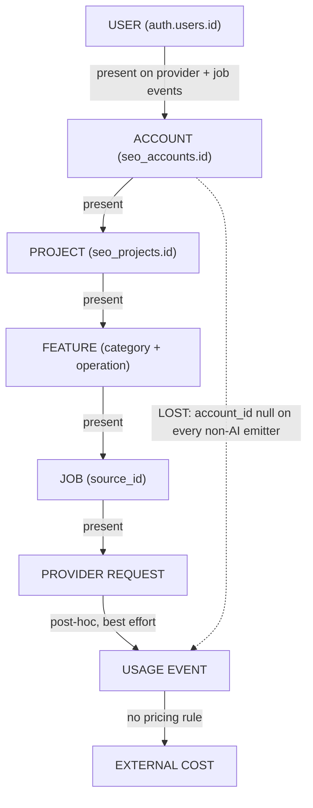

# Resource Protection and Monetization Recon

Status: recon complete. Documentation only. **No code, schema, migration,
contract, dependency, route or test change was made to produce this document.**
No billing, subscription, quota, tier, paywall, CAPTCHA, verification or account
restriction was added.

Baseline: `9e02c23 feat(analytics): load the Google tag on public pages only`.
Migrations remain at **38**; no new migration.

Primary question answered:

> If Old Skool SEO were opened to a large number of users tomorrow, what could
> one human, one bot, or one autonomous agent swarm actually consume, and what
> would that cost us?

All findings are grounded in a reachable code path (`file:line`). Where an
external vendor price is required to turn a usage fact into money, this document
marks it **External pricing/configuration required** and does not invent a
number.

---

## 1. Executive summary

The application is a **fully open, full-product, server-funded-by-default** SaaS
with an existing append-only usage ledger and a real BYOK path for *some* (not
all) AI providers.

- Authentication is Supabase-JWT only; the API never checks email/phone
  verification, allowlists, invites or approval
  (`apps/api/src/auth/jwt.ts:59-100`, `apps/api/src/http/middleware.ts:59-86`).
- Accounts are created lazily on first call and are free and unlimited
  (`apps/api/src/supabase.ts:208-217`,
  `supabase/migrations/20260101000011_accounts.sql:64-96`). Projects and members
  are unlimited (`supabase/migrations/20260101000006_rls.sql:316-340`).
- There are **no tiers, plans, billing, entitlements, quotas or spend caps**.
  The usage table says so explicitly: it "is not a billing table"
  (`supabase/migrations/20260101000031_usage_events.sql:6-7`,
  `apps/api/src/services/usageEventRepository.ts:10-12`).
- The only perimeter protection is a **process-local, in-memory, fixed-window
  rate limiter** (`apps/api/src/http/rateLimit.ts:59-113`) plus three class
  tiers (`apps/api/src/http/rateLimitClasses.ts:44-98`). It is not shared across
  processes, is keyed by user-or-IP, and does not cover `/api/v1` or `/api/mcp`.
- A single worker process executes jobs **strictly one at a time**
  (`apps/api/src/worker.ts:245-275`), but there is **no cap on how many jobs one
  project/account may enqueue**, so the queue can grow without bound.
- BYOK exists for AI chat/generation/image (**account -> project -> server env**,
  `apps/api/src/services/aiService.ts:169-172, 204-216`) and for DataForSEO when
  a user connects an account (`apps/api/src/providers/dataforseo/dataSource.ts:84-105`).
  It does **not** exist in production for embeddings
  (`apps/api/src/providers/knowledge/embedding.ts:111-136`,
  `apps/api/src/providers/qdrantKnowledge.ts:64`), Cohere rerank, Unsplash or
  Jina: those are always server-funded.
- The usage ledger attributes at the **project** level almost completely, the
  **user** level mostly, and the **account** level only for AI
  chat/generation (every other provider emitter hard-codes `accountId: null`,
  e.g. `apps/api/src/providers/gsc/providerUsage.ts:46-47`,
  `apps/api/src/providers/dataforseo/providerUsage.ts:70-71`,
  `apps/api/src/services/usageInstrumentation.ts:249-250`).

Financial exposure is therefore **not** in the Google integrations (the user's
own connected Google account and quota fund those). It is concentrated in the
**server env keys**: OpenAI (chat/generation/image), embeddings (always),
Cohere rerank, Unsplash, Jina, Qdrant infra, and the DataForSEO env fallback.
Those can incur a bill from an open, unverified signup, bounded only by a
per-process HTTP rate limit and the serial worker.

Stop-building verdict: monetization **can be postponed safely only if** the
server-funded keys are removed/capped and the generic job-enqueue bypass is
closed. As-is, the operator is exposed.

---

## 2. Current access model

### 2.1 Identity

- Auth is Supabase JWT: issuer pinned to `https://<host>/auth/v1`, audience
  `authenticated`, RS256 via JWKS with an HS256 fallback
  (`apps/api/src/auth/jwt.ts:59-84`). Failures collapse to a single 401.
- `optionalAuth` runs app-wide and treats an invalid token as anonymous
  (`apps/api/src/http/middleware.ts:59-73`); each router applies `requireAuth`.
- Signup, magic link and Google OAuth are performed by GoTrue from the browser
  (`apps/web/src/App.tsx:1185-1189, 1204, 1245+`). The API has no say and never
  reads `email_confirmed_at`, `invite`, `waitlist`, `allowlist` or `approval`.

### 2.2 Account / project / member

- User = one account, created lazily via `seo_ensure_account` on the first
  account-scoped call (`apps/api/src/supabase.ts:208-217`,
  `supabase/migrations/20260101000011_accounts.sql:64-96`). Execute is granted
  to `service_role` only (`.../20260101000034_harden_rls_security.sql:70-71`).
- Projects are created **directly from the browser** via the
  `seo_create_project` RPC, which only requires `auth.uid() is not null`
  (`supabase/migrations/20260101000006_rls.sql:316-340`). **No count limit.**
- Members have `viewer < editor < admin < owner`
  (`apps/api/src/supabase.ts:143-155`); **no member cap**
  (`supabase/migrations/20260101000002_projects_members.sql:37-45`).
- Project APIs are authorized by `requireRole`; enqueue is typically `editor+`,
  cancel is `admin` (e.g. `apps/api/src/http/routes/jobs.ts:32, 77`).

### 2.3 API keys and MCP

- `seo_live_` keys are 192-bit random, stored hashed, prefix-indexed
  (`apps/api/src/infra/apiKeys.ts:24-27, 51-82`). Scopes are only
  `read | write` (`:29-30`); **no expiry**, no count cap; revocation is a soft
  delete (`:161-179`).
- Project keys require project `admin` (`apps/api/src/http/routes/projectApiKeys.ts`).
  **Account (master) keys require only account ownership, no role gate**
  (`apps/api/src/http/routes/accountApiKeys.ts:22-27, 42-94`) and reach every
  project the creator belongs to (`apps/api/src/http/routes/v1.ts:77-94`).
- `/api/v1` and `/api/mcp` authenticate by API key, so `req.user` stays empty and
  the global limiters key on **IP** only (`apps/api/src/app.ts:229, 234`).

**Answer:** a brand-new signup gets the full product immediately, with zero
trust, zero verification and no spend cap.

---

## 3. Resource inventory

Each operation below is mapped to its provider, entry point and whether it is
user- or background-triggered.

### 3.1 Google

| Operation | Entry point | Requests per call | Credential |
|---|---|---|---|
| GSC `sites` (discovery/connect/test) | `integrations.ts`, `account.ts`, `projectGsc.ts` | 1 | user OAuth |
| GSC `searchAnalytics` daily | `gsc_sync` job (`apps/api/src/jobs/executors.ts:171`) | 1 (`rowLimit 400`) | user OAuth |
| GSC `searchAnalytics` dimension | same (`executors.ts:173, 175`) | 2 x `ceil(days/7)` (`rowLimit 25000`) | user OAuth |
| GA4 `accountSummaries` / `dataStreams` | `GET /analytics/properties` | 1 + up to 20 | user OAuth |
| GA4 `runReport` (page traffic / daily) | `GET /analytics/page-traffic`, `analytics_sync` | 1 | user OAuth |
| Ads `listAccessibleCustomers` / `searchStream` | `GET /ads/customers`, `GET /ads/report` | `1 + N`; report = 2 | user OAuth + operator dev token |

Evidence: `apps/api/src/providers/gsc/gscApi.ts:118-152`,
`apps/api/src/providers/gsc/gscDataSource.ts:224-262`,
`apps/api/src/providers/ga4/googleAnalyticsClient.ts:184-298`,
`apps/api/src/providers/googleAds/googleAdsClient.ts:338-472`,
`apps/api/src/services/googleAnalyticsService.ts:49-63`,
`apps/api/src/services/googleAdsService.ts:52-64`,
`apps/api/src/jobs/executors.ts:145-247`.

Google data access is funded by **the user's connected Google account**
(their quota). The operator supplies only the OAuth client and (optionally) the
Ads developer token (`apps/api/src/config.ts:49-61`).

### 3.2 DataForSEO

Endpoints actually used (all in `apps/api/src/providers/dataforseo/dataForSeoClient.ts`):

| Endpoint | Line | Trigger |
|---|---|---|
| `POST /v3/serp/google/organic/task_post` | `:326-329` | `dataforseo_rank_sync` |
| `GET /v3/serp/google/organic/tasks_ready` | `:332-335` | poll |
| `GET /v3/serp/google/organic/task_get/regular/{id}` | `:343-354` | poll |
| `POST /v3/serp/google/organic/live/regular` | `:357-371` | `serp_retrieval` |
| `POST /v3/dataforseo_labs/google/keyword_suggestions/live` | `:382-405` | KW2 / expansion `suggestions` |
| `POST /v3/dataforseo_labs/google/related_keywords/live` | `:412-436` | expansion `related` |
| `POST /v3/dataforseo_labs/google/keyword_ideas/live` | `:444-468` | expansion `ideas` |
| `POST /v3/dataforseo_labs/google/keyword_difficulty/live` | `:476-494` | **no production caller (dead)** |
| `POST /v3/dataforseo_labs/google/competitors_domain/live` | `:503-521` | competitor `discover` |
| `POST /v3/dataforseo_labs/google/domain_intersection/live` | `:531-568` | competitor `gap` |

Pacing: one call per 1500 ms per client (40 req/min, `dataForSeoClient.ts:223-224`);
client retry 4 attempts on `429/5xx` (`:183, 266-273`, `apps/api/src/reliability/retry.ts:117-122`);
poll deadline 4 minutes (`apps/api/src/providers/dataforseo/dataSource.ts:59-61, 482-528`).
**External pricing/configuration required** for DataForSEO unit costs.

Credential resolution (`dataSource.ts:84-105`): stored account/project token ->
server `DATAFORSEO_BASE64` -> stored login/password -> server
`DATAFORSEO_LOGIN/PASSWORD` -> `notConfigured`. **User credential wins; env is
the operator-funded fallback.**

### 3.3 AI

| Capability | Provider/model | Credential | Instrumented |
|---|---|---|---|
| Chat / generate | OpenAI `gpt-4o-mini` (default) | account/project/env (`aiService.ts:169-172`) | yes, account-scoped |
| Embeddings | OpenAI `text-embedding-3-small` | env only (`embedding.ts:127-133`) | yes, project+user, account null |
| Image generation | OpenAI `dall-e-3` (`n=1`) | account/project/env (`aiService.ts:204-216`) | yes, media fact |
| Content agent | OpenAI chat (hardcoded temp 0.4, `maxTokens 5000`) | same chain | yes |
| Writer (quick) | chat, 1 planner + 1/section | same chain | yes |
| Writer (deep) | chat, <= 90 calls | same chain | yes |
| Designer planner/revision | chat, <= 4000 tokens | same chain | yes |
| Rerank | Cohere | env only (`reranker.ts:20-28`) | no usage event |

Evidence: `apps/api/src/providers/ai/openai.ts:33-43, 163-232`,
`apps/api/src/providers/knowledge/embedding.ts:40-136`,
`apps/api/src/providers/media/openaiMedia.ts:78-126`,
`apps/api/src/services/contentAgentService.ts:126, 207-215`,
`apps/api/src/agents/writer/planner.ts:50, 60`,
`packages/contracts/src/writer.ts:84`,
`apps/api/src/agents/designer/planner.ts:156-157`.
**External pricing/configuration required** for OpenAI/Cohere token and image
prices.

### 3.4 Publishing and media

| Adapter | External call | Credential |
|---|---|---|
| WordPress | create/update/delete post | project credentials (user-supplied) |
| X | `POST /2/tweets` | user OAuth; operator OAuth client |
| Unsplash | search | **server `UNSPLASH_ACCESS_KEY`** |
| OpenAI media | image generate | account/project/env |
| mock_social | none | test-only |

Evidence: `apps/api/src/providers/wordpress.ts`,
`apps/api/src/providers/social/xPublisher.ts`,
`apps/api/src/providers/media/unsplash.ts:50-83`,
`apps/api/src/providers/publishing/providerUsage.ts:1-20`,
`apps/api/src/providers/registry.ts:251-346`.

---

## 4. Provider inventory (funding)

| Provider | BYOK? | Server-funded fallback | Notes |
|---|---|---|---|
| GSC | yes (user Google account) | no data-token fallback | operator OAuth client only |
| GA4 | yes (user Google account) | no data-token fallback | operator OAuth client only |
| Google Ads | yes (user Google account) | no data-token fallback | operator dev token optional |
| DataForSEO | yes (stored creds) | `DATAFORSEO_*` env | user creds shadow env |
| OpenAI (text) | yes (account/project) | `OPENAI_API_KEY` | precedence account->project->env |
| OpenAI image | yes (account/project) | `OPENAI_API_KEY` | same chain |
| Embeddings | **no** | `EMBEDDINGS_API_KEY` -> `OPENAI_API_KEY` | always server-funded in prod |
| Cohere rerank | **no** | `KNOWLEDGE_RERANKER_API_KEY` | server-only |
| Unsplash | **no** | `UNSPLASH_ACCESS_KEY` | server-only |
| Jina fetch | **no** | `JINA_API_KEY` | server-only |
| Qdrant | n/a (infra) | `QDRANT_URL`/`QDRANT_API_KEY` | server infra |
| WordPress | yes (project creds) | none | user-owned |
| X | yes (user OAuth) | operator OAuth client | user-owned |

Registry descriptors: `apps/api/src/providers/registry.ts:198-346`; env wiring:
`apps/api/src/context.ts:114-166`.

---

## 5. Cost classification

Classification reflects implementation behavior, not vendor pricing.

| Resource | Class | Basis |
|---|---|---|
| GSC reads | LOW COST (user-funded) | per-request quota on user account; `gscDataSource.ts:224-262` |
| GA4 reads | LOW COST (user-funded) | 1-2 requests; `googleAnalyticsService.ts:294-346` |
| Ads reads | LOW COST (user-funded) | 1-2 requests + customer fan-out; `googleAdsService.ts:397-400` |
| DataForSEO keyword calls | MATERIAL COST (mixed) | per-task vendor billing; env fallback operator-funded; `dataSource.ts:147-254` |
| DataForSEO SERP rank sync | MATERIAL COST (mixed) | up to 100 keywords, batched+polled; `executors.ts:260-310` |
| DataForSEO competitor | MATERIAL COST (mixed) | 1 + <=3 calls; `executors.ts:487-551` |
| AI chat/generation | MATERIAL/HIGH (mixed) | token-priced; env fallback; `aiService.ts:169-195` |
| Writer deep run | HIGH (mixed) | <= 90 LLM calls; `writer.ts:84` |
| Designer run | HIGH (mixed) | up to 32 steps, no aggregate budget; `designer.ts:60`, `designerService.ts:204-272` |
| Embeddings | MATERIAL (server-only) | always operator-funded; `embedding.ts:111-136` |
| Image generation | MATERIAL (mixed) | `n=1` per call; `openaiMedia.ts:88` |
| Unsplash search | LOW COST (server-only) | operator key; `unsplash.ts:76-80` |
| Jina fetch | LOW/MATERIAL (server-only) | operator key; `jinaKnowledgeFetcher.ts:88-100` |
| Cohere rerank | LOW COST (server-only) | operator key; `cohereReranker.ts:46-60` |
| WordPress publish | FREE (user-owned) | one request; `providerUsage.ts` |
| X publish | LOW COST (user-owned) | one request |
| Generic `/jobs` path | **UNBOUNDED / DANGEROUS** | arbitrary params, bypasses route validators; `jobs.ts:27-55` |
| MCP / v1 | **UNBOUNDED / DANGEROUS** | expensive tools, only IP rate-limited; `mcp/server.ts`, `app.ts:229, 234` |

**External pricing/configuration required** for every vendor above.

---

## 6. Request multiplication

The canonical chain is:

```text
1 UI action -> 1 API request -> 1 job -> N provider requests -> N polls -> N retries
```

Concrete chains found:

- **Keyword expansion (route)**: 1 job; `related` loops **one provider call per
  seed** (`executors.ts:393-395`); `suggestions` loops per seed inside
  `researchKeywords` (<= 20, `dataSource.ts:162`); `ideas` is one call. Route
  caps seeds at 5 (`packages/contracts/src/api.ts:1848`), so a normal run is
  <= 11 DataForSEO calls.
- **Keyword expansion (generic `/jobs`)**: same executor but the seed cap is a
  **route-level** validator only; `runKeywordExpansion` never re-clamps seeds
  (`executors.ts:361-420`), so `related` becomes **one call per supplied seed** -
  unbounded.
- **GSC sync**: `1 + 2 * ceil(days/7)` requests, each dimension request up to
  25 000 rows (`executors.ts:171-175`, `gscDataSource.ts:260-262`). `days` is
  unbounded on the generic `/jobs` path (`executors.ts:153`); the performance
  route caps 7/28/90 (`apps/api/src/http/routes/projectPerformance.ts:54`).
- **DataForSEO rank sync**: up to 100 keywords -> 2 `task_post` batches (50 each)
  -> `tasks_ready` polled every 5 s for up to 4 minutes -> up to 100
  `task_get` (`dataSource.ts:296-346, 482-528`). Potentially hundreds of HTTP
  round-trips per job.
- **Writer quick**: 1 planner + 1 section-writer per section (<= 12 sections)
  (`planner.ts:50`). **Writer deep**: <= 90 LLM calls (`writer.ts:84`).
- **Designer**: up to 32 steps (`designer.ts:60`); AI steps each make a call with
  their own retry, **no aggregate AI-call budget** across the run
  (`designerService.ts:204-272`).
- **content_images**: <= 6 placeholders, each 1 search and (on miss) 1 generate
  -> <= 12 external media calls (`executors.ts:1007-1064`).
- **Retry amplification**: client retry up to 4 attempts
  (`reliability/retry.ts:117-122`) and a per-job provider-retry budget of 4
  (`config.ts:147`, `worker.ts:141-152`). Job-level retries default to 3
  (`supabase/migrations/20260101000005_jobs_publishing.sql:28`), route-capped 0-10
  (`jobs.ts:40`). A retried execution re-issues its provider requests.

---

## 7. Job analysis

- **Creation**: `POST /api/projects/:projectId/jobs` (editor+) via the shared
  gate `enqueueJob` (`apps/api/src/jobs/enqueue.ts:148-195`), plus direct
  `jobStore.enqueue` call sites in `scheduleService.ts:195`, `v1.ts:178`,
  `mcp/server.ts:316, 350`, `knowledgeService.ts`, `publicationJobs.ts:182`,
  `opportunities.ts:204`, `content.ts:87, 108, 266`, `agentRunService.ts:237, 431`,
  `contentDraftService.ts:178`.
- **Scoping**: every job carries `project_id` and `created_by`; the DB has a
  `(project_id, idempotency_key)` unique index
  (`supabase/migrations/20260101000035_harden_data_integrity.sql:194-197`).
- **Worker/job registry split (known finding)**: the worker dispatches from
  `EXECUTORS` (`apps/api/src/jobs/executors.ts:1144-1166`) while the enqueue gate
  validates against `KNOWN_JOB_TYPES` (`apps/api/src/jobs/enqueue.ts:17-32`).
  The two lists differ: `content_generate/write/images/analyze`, `agent_design`,
  `knowledge_source_*` and `publish*` exist as executors but are **not** in the
  gate vocabulary, so they are enqueued by direct store calls that skip the
  connected-integration check. **Resource-protection weakness: yes** - gating is
  not uniform, and any row that reaches the queue is executed regardless of how
  it was created.
- **Concurrency**: `runOnce` claims one job and awaits it before returning; the
  worker loop is sequential (`apps/api/src/worker.ts:104-188, 245-275`). One
  worker process = one running job. Parallelism is whatever number of worker
  processes the operator starts. **No worker-concurrency config.**
- **Queue caps**: none. No per-project or per-account queued/running limit
  exists anywhere.
- **Retry/timeout/cancel**: exponential backoff capped 1 h
  (`jobs/types.ts:69-73`); circuit breaker 5 failures / 30 s cooldown
  (`reliability/circuitBreaker.ts:36-40`); stale-running sweep at 25 min
  (`worker.ts:27, 34-80`); cancel is `admin` (`jobs.ts:71-85`); schedules are
  planning rows that enqueue one publish each (`scheduleService.ts:195`).
- **Autonomy**: a schedule fires with no further user action; there is a
  `next_refresh_at` knowledge-refresh concept but **no server sweeper enqueues
  it** (manual route only), so autonomous background cost today comes from
  scheduled publishes, not knowledge refresh.

**Answer:** one editor can enqueue 100+ expensive jobs as fast as the process-local
`moderate` tier (60/min) allows. Queue depth is unbounded.

---

## 8. Usage / metering analysis

Vocabulary (`packages/contracts/src/usageEvent.ts`): categories `ai`,
`dataforseo`, `google`, `job`, `publishing`, `media` (`:47`); units include
`request`, `task`, `keyword`, `serp_request`, `gsc_request`, `ga4_request`,
`ads_request`, `input_token`, `output_token`, `image_generation`, `asset`,
`publish_attempt`, `job` (`:61-75`). Cost/pricing is deliberately **not** stored
(`:20-22`).

### What is measured

| Resource | Event | Account | Project | User | Measured after call? |
|---|---|---|---|---|---|
| AI chat/generate | `ai/*_token` | yes | yes | yes | yes (post-call) |
| AI embed | `ai/embed/input_token` | **null** | yes | yes | yes |
| DataForSEO | `dataforseo/*` | **null** | yes | yes | yes |
| GSC | `google/gsc_request` | **null** | yes | yes | yes |
| GA4 | `google/ga4_request` | **null** | yes | yes | yes |
| Ads | `google/ads_request` | **null** | yes | yes | yes |
| Media | `media/*` | **null** | yes | yes | yes |
| Publishing | `publishing/publish_attempt` | **null** | yes | yes | yes |
| Job execution | `job/job` | **null** | yes | yes (`created_by`) | yes (terminal only) |

### What is partially measured / unmetered

- **Partially measured**: AI (account present only for chat/generate); Google
  (project+user only); DataForSEO (project+user only).
- **Unmetered entirely**: Cohere rerank, Jina fetch, Qdrant storage/compute, the
  Google OAuth client itself, the operator's own server compute and worker time.
- **Measured but not connected to a cost**: everything - there is no pricing
  rule or cost derivation anywhere.
- **Measured only after the expensive request**: all provider facts and the job
  fact are emitted post-hoc. There is no pre-request budget check, so metering
  can describe consumption but cannot prevent it.

Evidence: `packages/contracts/src/usageEvent.ts`,
`apps/api/src/services/usageEventRepository.ts:227-307`,
`apps/api/src/services/usageInstrumentation.ts:109-201, 233-269`,
provider emitters under `apps/api/src/providers/*/providerUsage.ts`,
`apps/api/src/providers/knowledge/embeddingUsage.ts:59-97`,
`apps/api/src/providers/media/mediaUsage.ts:36-80`.

---

## 9. Metering completeness matrix

| Resource | Used by | Metered? | Scope | Cost known? | Limit exists? | Abuse risk |
|---|---|---|---|---|---|---|
| GSC | Search Console | yes | project+user | no | user quota only | medium (unbounded days via `/jobs`) |
| GA4 | Performance | yes | project+user | no | periods 7/28/90 | low |
| Ads | Ads intelligence | yes | project+user | no | per-report limit 100 | low/medium (customer fan-out) |
| DataForSEO | Keywords/Competitors/Rank | yes | project+user | no | route caps; env fallback | **high** |
| AI text | Writer/Composer/Agent | yes | account+project+user | no | per-call token caps | **high** |
| Embeddings | Knowledge | yes | project+user | no | chunk caps; no BYOK | **high** |
| Image generation | Designer/Media | yes | project+user | no | `n=1`, <=6/job | medium |
| Unsplash | Media resolver | yes | project+user | no | limit 8 | low |
| Cohere rerank | Knowledge | **no** | - | no | none | low |
| Jina fetch | Knowledge discovery | **no** | - | no | 25 pages | low/medium |
| WordPress | Publishing | yes | project+user | no | - | low |
| X | Publishing | yes | project+user | no | - | low |
| Generic `/jobs` | any job type | as above | project+user | no | **none** | **high** |
| `/api/mcp` `/api/v1` | agents | as above | project+user | no | IP only | **high** |

---

## 10. Rate limits

Implementation is fixed-window, in-memory per process, fail-open on storage,
fixed windows only (`apps/api/src/http/rateLimit.ts:1-114`). Default key is
`req.user?.sub ?? req.ip` (`:49-52`).

| Limiter | Mount | Key | Window | Max | Methods | Evidence |
|---|---|---|---|---|---|---|
| pre-auth global | `/api` before auth | IP | 60 s | 300 | all | `app.ts:128-133`, `config.ts:137` |
| auth global | `/api` after `optionalAuth` | user sub / IP | 60 s | 600 | all | `app.ts:159-164`, `config.ts:138` |
| `strict` | oauth, account/project api-keys | user sub / IP | 60 s | 20 | all | `rateLimitClasses.ts:48-58` |
| `expensive` | keyword, composition, designer, content, knowledge, gsc, analytics, media | user sub / IP | 60 s | 30 | mutating | `rateLimitClasses.ts:60-74` |
| `moderate` | jobs, publications, schedules | user sub / IP | 60 s | 60 | mutating | `rateLimitClasses.ts:76-84` |

Properties and gaps:

- Limits are **process-local**, so horizontal scaling multiplies the effective
  budget; a restart resets every bucket.
- Disabled under `NODE_ENV=test` or `RATE_LIMIT_DISABLED=true`
  (`apps/api/src/config.ts:212-220`).
- A rate limit on the HTTP endpoint does **not** protect the underlying job or
  provider calls: once a job is queued, it runs regardless.
- **Not covered by any class tier** (only the global IP/user budget applies):
  `/api/v1`, `/api/mcp`, `/api/projects/:projectId/integrations`,
  `.../publishers`, `.../ai`, `.../cosmos`, `.../ads`, `.../performance`,
  `.../usage`, and `/api/account/*` except `api-keys`
  (`rateLimitClasses.ts:47-85`, mounts `app.ts:175-234`).
- API-key callers are keyed by IP, not per key or per account, so a shared IP
  gives all its keys one combined ceiling.

---

## 11. Concurrency

- HTTP: bounded only by the rate limiters above.
- Jobs: one at a time per worker process (`worker.ts:245-275`); unbounded queue.
- DataForSEO: 40 req/min per client instance (`dataForSeoClient.ts:223-224`),
  sequential per invocation; `TASK_BATCH_SIZE = 50`.
- Google: GA4 URL lookup concurrency 5 (`googleAnalyticsClient.ts:27`);
  otherwise sequential.
- AI: sequential per run; no global AI concurrency gate.
- Embeddings: sequential batches of 8 (`embedding.ts:72`) or 16
  (`openai.ts:219`).
- Publishing: one attempt per job; no fan-out.

**Can one account create 100 expensive operations concurrently?** Effectively
yes as *queued* work: 60 job enqueues/min (moderate tier) with no queue cap, and
expensive routes at 30/min. Execution is serialized by the worker, so the impact
is cost backlog and latency, not instantaneous fan-out - unless the operator
runs many worker processes.

**Can 1,000 accounts each create 100?** Yes. There is no account-level or
global budget; each account gets its own per-user bucket once authenticated, and
unverified signup is unlimited.

---

## 12. Account creation

- Signup is open and unlimited; the API creates an account lazily on first use
  (`supabase.ts:208-217`).
- No email/phone verification, invite, allowlist or approval is enforced by the
  API (`auth/jwt.ts`, `http/middleware.ts`).
- A new account can create unlimited projects immediately and is `owner` of each
  (`rls.sql:49-66, 316-340`).
- A new account can mint unlimited master API keys with no role gate
  (`accountApiKeys.ts:22-27`).
- No trust level exists. Account creation consumes only Postgres rows; the
  expensive exposure begins at the first provider call.

---

## 13. BYOK analysis

```text
account key  (seo_integrations vault, AES-256)
    |
    v
project override  (seo_credentials scope 'ai')
    |
    v
server OPENAI_API_KEY
    |
    v
not configured
```

Resolution: `accountKey ?? projectKey ?? envKey`
(`apps/api/src/services/aiService.ts:169-172`); image generation uses the same
chain (`:204-216`). Key source is reported as `account | project | env | none`
(`:181`). The browser never receives the key.

Who pays when BYOK is used:

- **User**: AI text, AI image, and DataForSEO when a stored credential exists
  (`dataSource.ts:84-105`), plus Google data via the user's own OAuth account.
- **Operator**: everything when no BYOK key is present, and **always** for
  embeddings, Cohere rerank, Unsplash and Jina in production
  (`embedding.ts:111-136`, `qdrantKnowledge.ts:64`,
  `cohereReranker.ts:46-60`, `unsplash.ts:50-83`, `context.ts:114-166`).

Can the ledger distinguish the two? **Only for AI chat/generate** via the
`accountId` scope; every other emitter discards it
(`dataforseo/providerUsage.ts:70`, `gsc/providerUsage.ts:46`,
`ga4/providerUsage.ts:45`, `googleAds/providerUsage.ts:46`,
`media/mediaUsage.ts:48`, `publishing/providerUsage.ts:83`,
`embeddingUsage.ts:67`, `usageInstrumentation.ts:249`). There is no `keySource`
or `funding` field on any usage event.

---

## 14. Cost attribution

| Question | Answer | Class |
|---|---|---|
| Which account caused this cost? | Only AI chat/generate events carry `account_id` | **PARTIAL** |
| Which project caused this cost? | Every provider/job event carries `project_id` | **YES** |
| Which user/member caused this cost? | Provider + job events carry `user_id` (jobs use `created_by`; worker-origin provider calls inherit it) | **PARTIAL/YES** |
| Which feature caused this cost? | `category` + `provider` + `operation` | **YES** |
| Which job caused this cost? | `sourceId = job.id` | **YES** |

---

## 15. Cost attribution graph



Identity is lost at exactly one point: the **account** segment of the chain,
except for AI text/image. Adding pricing later is a derivation over existing
facts; adding account attribution is the missing join.

---

## 16. Worst-case scenarios

| # | Scenario | Limiting factor | Who pays |
|---|---|---|---|
| A | One user loops keyword research | moderate/expensive HTTP tier; DataForSEO 40/min | env DataForSEO creds if unconnected |
| B | One user loops competitor analysis | 1 + 3 calls per job; daily spend not capped | env DataForSEO creds |
| C | One user mass-generates AI content | per-job token caps; BYOK or env | BYOK, else operator |
| D | One user loops embeddings | always operator env | **operator always** |
| E | One user loops image generation | `n=1`; BYOK or env | BYOK, else operator |
| F | One account creates many projects | unlimited projects; user creds per project if connected | operator if env fallback |
| G | Many new accounts run the same op | open signup, no verification, no account budget | operator for env-billed providers |
| H | Agent swarm drives MCP/v1 | IP-only rate limit; serial worker | operator for env-billed providers |

---

## 17. Existing hard ceilings

"Product UX limit" means a frontend or route validator; "server enforcement"
means the value is re-checked where the work actually runs.

| Ceiling | Value | Server-enforced? | Evidence |
|---|---|---|---|
| Global IP / user rate | 300 / 600 per min | yes (process-local) | `app.ts:128-164` |
| strict / expensive / moderate | 20 / 30 / 60 per min | yes (process-local) | `rateLimitClasses.ts:44-98` |
| Jobs queued/running per project | none | **no** | - |
| Worker concurrency | 1 per process | implicit | `worker.ts:245-275` |
| Job `max_retries` | default 3, route 0-10 | yes | `jobs_publishing.sql:28`, `jobs.ts:40` |
| Per-job provider retry budget | 4 | yes | `config.ts:147`, `worker.ts:141-152` |
| DataForSEO rank keywords | 100 | yes | `executors.ts:260` |
| DataForSEO live SERP keywords | 50 | yes | `executors.ts:318` |
| DataForSEO research seeds | 20 | yes | `dataSource.ts:153` |
| DataForSEO competitor candidates | 20 | yes | `contracts/api.ts:1673` |
| DataForSEO gap competitors | 3 | yes | `contracts/api.ts:1676` |
| Keyword expansion seeds | 5 | **route only** | `contracts/api.ts:1848`, bypass via `jobs.ts` |
| Keyword expansion limit/results | 200 / 500 | mixed | `contracts/api.ts:1851-1857` |
| GSC sync days | unbounded on `/jobs`; 7/28/90 on route | **mixed** | `executors.ts:153`, `projectPerformance.ts:54` |
| GSC row limits | 400 daily / 25 000 per chunk | yes | `gscDataSource.ts:231, 262` |
| GA4 periods | 7/28/90 | yes | `googleAnalyticsService.ts:49-63` |
| Ads report limit | 100 | yes | `googleAdsService.ts:56` |
| Writer sections / deep calls | 12 / 90 | yes | `planner.ts:50`, `writer.ts:84` |
| Writer agent steps | 5 | yes | `agent.ts:88-98` |
| Designer steps | 32 | yes (contract) | `designer.ts:60` |
| Designer aggregate AI calls | none | **no** | `designerService.ts:204-272` |
| Content agent tokens/images | 5000 / <=4 | yes | `contentAgentService.ts:126, 215` |
| Content AI maxTokens | <=1600-2000 | yes | `contentAiService.ts:57-65` |
| Embedding batch | 8 / 16 | yes | `embedding.ts:72`, `openai.ts:219` |
| Knowledge chunks | 400 | service only | `knowledge/limits.ts:25`, `knowledgeService.ts:1914-1915` |
| Qdrant index documents | none at provider seam | **no** | `qdrantKnowledge.ts:94-129` |
| Image generation `n` | 1 | yes | `openaiMedia.ts:88` |
| content_images placeholders | <=6 | yes | `executors.ts:1007` |
| Upload sizes | 12 MB raw / 10 MB knowledge file | yes | `app.ts:190-216`, `knowledge/limits.ts:29` |

---

## 18. Provider exposure

> Can Old Skool SEO incur a bill without the provider/account owner performing
> another action?

| Provider | Operator can be billed with no further user action? | How |
|---|---|---|
| OpenAI (text/image) | **yes**, when no BYOK | env fallback; jobs/schedules run server-side |
| Embeddings | **yes, always** | env only; indexing is a job |
| Cohere rerank | **yes** | env only; retrieval calls it |
| Unsplash | **yes** | env only; search + content_images |
| Jina | **yes** | env only; discovery/fetch |
| DataForSEO | **yes**, when no user credential | env fallback |
| Qdrant | **yes** | server infra |
| GSC / GA4 / Ads | no (user's Google account) | user OAuth token required |
| WordPress / X | no (user credentials) | user-owned |

The distinguishing question is answered: Google and publishing are effectively
user-funded; the server env keys are the operator's financial surface.

---

## 19. Monetization models

Analysed only. None is chosen or implemented.

### Model A - Full product, usage limits
- Complexity: medium (needs pre-request budget checks + a counter store).
- Abuse resistance: good if the counter is server-side and account-scoped.
- Friction: moderate; users hit invisible walls.
- Margin: predictable.
- Bots/agents: workable, but must be keyed per account/key.
- Compatibility: the usage ledger already exists; needs account attribution
  and a pre-request check.
- New infra: account-scoped counters, atomic reservation, budget config.

### Model B - Full product + BYOK
- Complexity: low for providers that already support BYOK (AI, DataForSEO);
  medium for embeddings/rerank/Unsplash/Jina, which have no BYOK path.
- Abuse resistance: excellent - the user's own key absorbs cost.
- Friction: high for non-technical users.
- Margin: near-zero cost to the operator.
- Bots/agents: naturally self-limiting (they must supply keys).
- Compatibility: matches the existing AI/DataForSEO architecture.
- New infra: BYOK paths for the currently server-only providers, plus key
  validation.

### Model C - Hosted resource bundles
- Complexity: medium/high (must fund and resell each provider).
- Abuse resistance: good with caps; needs the same counters as A.
- Friction: low for users.
- Margin: depends entirely on vendor pricing (**external pricing required**).
- Compatibility: requires cost derivation (usage -> pricing -> cost).
- New infra: pricing table, cost report, bundles, enforcement.

### Model D - Hybrid (free/full + BYOK, paid hosted resources)
- Complexity: medium; combines B for technical users with C for the rest.
- Abuse resistance: good; server resources are rationed, BYOK is free.
- Friction: low/optional.
- Margin: predictable for the rationed portion.
- Compatibility: best fit - the ledger, BYOK and provider interfaces all exist.
- New infra: account attribution, pre-request budget, pricing derivation.

### Model E - Subscription + usage
- Complexity: high (billing provider, invoices, dunning).
- Abuse resistance: good.
- Friction: high.
- Margin: predictable but operationally heavy.
- Compatibility: needs everything in C plus billing.
- New infra: payment provider, subscription state, entitlement checks.

---

## 20. Can monetization happen without feature gating?

The product philosophy "full product access is technically possible" is
compatible with resource-based controls **for AI and DataForSEO** because those
already have BYOK and a usage ledger. It is **not yet sufficient** for
embeddings/rerank/Unsplash/Jina, which are server-only and unmetered for cost,
and it is **not safe** while the generic `/jobs` bypass and the uncovered
`/api/mcp` / `/api/v1` surfaces exist. The cost analysis does **not** support
concluding that resource-based controls are sufficient today.

---

## 21. Pre-launch protection (recommendation only)

### MUST HAVE
1. **Do not launch with operator-funded env keys and open signup.** Either never
   set `OPENAI_API_KEY` / `EMBEDDINGS_API_KEY` / `DATAFORSEO_*` (force BYOK), or
   add an account-scoped budget that is checked **before** enqueue.
2. **Close the generic `/jobs` param bypass** (`apps/api/src/http/routes/jobs.ts:27-55`)
   so `gsc_sync` days and keyword-expansion seeds are validated server-side, not
   only at feature routes.
3. **Extend rate limiting to `/api/mcp` and `/api/v1`**, keyed per account/API
   key rather than IP.

### SHOULD HAVE
4. **Account attribution on every usage event** (the single missing join).
5. **Per-account job admission control** (queued/running cap).
6. **Distributed rate limiting** (shared store) if the API scales horizontally.
7. **A pre-request budget check** so metering both describes and prevents.

### LATER
8. Pricing rules and a cost derivation (`usage -> pricing -> cost`).
9. Spending dashboards and per-project budgets.
10. A BYOK path for embeddings/rerank/Unsplash/Jina if those are to be user-funded.

---

## 22. Recommended next steps

Recon-only; no implementation in this phase. Proposed order:
1. Decide whether the operator funds AI/embeddings/DataForSEO at all.
2. If yes, add an account-scoped pre-request budget and attribution.
3. If no, require BYOK for those providers and remove env fallbacks.
4. Close the `/jobs` validation bypass and cover `/api/mcp` + `/api/v1`.
5. Only then revisit monetization models.

---

## 23. Explicit non-goals

This phase did **not** and must not:
add billing, Stripe, subscriptions, tiers, quotas, paywalls, CAPTCHA,
email/phone verification; change signup, authentication, BYOK or usage
semantics; refactor the worker; change provider behavior; or change the database
schema. No migration, dependency or test was added.

---

## 24. Final verdict

1. **Can a normal human use the full product without meaningful resource
   protection?** Yes. The only protection is a process-local, IP/user-keyed
   in-memory rate limiter.
2. **Can one malicious account consume materially more than intended?** Yes -
   unbounded job queue, `/jobs` param bypass, and master API keys with no
   per-key budget.
3. **Can many newly created accounts amplify it?** Yes - open, unverified,
   unlimited signup with no account budget.
4. **Can autonomous agents perform expensive operations without meaningful
   friction?** Yes, via account API keys + `/api/mcp` and `/api/v1`, which are
   only IP-limited.
5. **Which resources represent the largest potential financial exposure?**
   Server-funded AI text/generation, embeddings (always server-funded),
   DataForSEO env fallback, and image generation when no BYOK key is set.
6. **Which resources are already safely user-funded/BYOK?** Google
   GSC/GA4/Ads data, WordPress and X publishing, DataForSEO when a user
   connects, and AI text/image when a BYOK key is present.
7. **Which resources are currently server-funded?** Embeddings, Cohere rerank,
   Unsplash, Jina, Qdrant, and - as a fallback - AI text/image and DataForSEO.
8. **What percentage of meaningful external consumption is attributable through
   the ledger?** Project ~100%, user mostly; **account** attribution exists only
   for AI chat/generate, so account-level attribution is far below 100% (every
   other emitter hard-codes `accountId: null`).
9. **What is the minimum protection before public launch?** Force BYOK or add an
   account-scoped pre-request budget; close the `/jobs` param bypass; cover
   `/api/mcp` and `/api/v1` with abuse-resistant limits.
10. **Can monetization be postponed safely?** Only if the server-funded keys are
    removed or capped first. As-is, no.
11. **If it cannot be postponed, what is the smallest architectural addition?**
    An account-scoped, atomically reserved usage counter checked at enqueue and
    at each expensive provider gate, plus server-side validation of job params
    and per-key limits on MCP/v1 - all over the existing usage ledger.
12. **Which monetization model best fits the actual cost structure?** **Model D
    (Hybrid)** - full product plus BYOK, with paid hosted resources - because
    BYOK, provider interfaces and an append-only usage ledger already exist, and
    the missing pieces (account attribution, pricing derivation, budget
    enforcement) are additive rather than a redesign.

All monetary amounts are **External pricing/configuration required**; this
document deliberately contains no fabricated costs.
